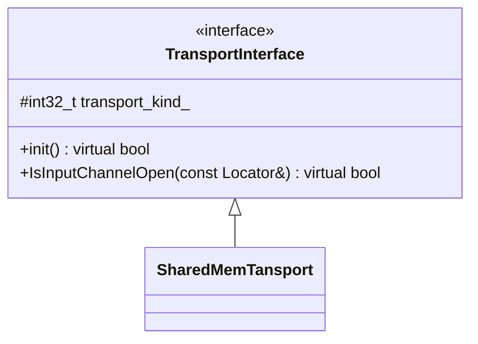

##### 6. Transport Layer

eProsima Fast DDS提供五中传输方式:

* udpv4
* udpv6
* tcpv4
* tcpv6
* shm

进程内数据传输和数据共享传输虽然不是传输模块的一部分，但也可用于在某些设置下在实体间发送消息。

###### 6.1.1 TransportDescriptorInterface

######  6.1.2. TransportInterface

######  6.1.3. Locator

在 TCP 中，定位器端口分为物理端口和逻辑端口。

    物理端口是网络设备使用的端口，也就是操作系统理解的真实端口。它存储在成员端口的两个最小有效字节中。
    
    逻辑端口是 RTPS 端口。RTPS 协议使用它来区分不同的实体。它存储在成员端口中最重要的两个字节中。

在 TCP 中，这种区分允许使用不同 RTPS 端口（逻辑端口）的多个 DDS 应用程序共享同一个物理端口，因此只需为所有通信打开一个端口即可。在 UDP 中，只有物理端口，它也是 RTPS 端口，存储在成员端口的两个最小有效字节中。

定位器地址以 16 个字节表示，其管理方式取决于使用的协议是 IPv4 还是 IPv6。

    IPv6 地址使用 16 个可用字节表示唯一的全局地址。
    
    IPv4 地址将这 16 个字节分为以下三个部分，重要性从低到高排列：
    
        4 个字节 LAN IP：本地子网标识（UDP 和 TCP）。
    
        4 个字节 WAN IP：公共 IP（仅 TCP）。
    
        8 个字节未使用。
    
                        定位器 IPv4 地址
+--------+-----------------------------+-----------------------------+
| 未使用 | WAN 地址 (62.128.41.210) | LAN 地址 (192.168.0.113) | IPv4 地址。
+--------+-----------------------------+-----------------------------+
 8 字节（仅 TCP） 4 字节 4 字节


                        定位器 IPv6 地址
+--------------------------------------------------------------------+
| 地址 (2001:0000:130F:0000:0000:09C0:876A:130B) |
+--------------------------------------------------------------------+
                              16 个字节

查看如何在 TCP IPv4 传输描述符 api 部分操作广域网地址。


#####  6.4 Shared Memory Transport

SHM 传输比 UDP / TCP 等其他网络传输具有更好的性能，即使这些传输使用环回接口。这主要是由于以下原因：

```markdown
    支持大型信息： 网络协议需要对数据进行分片，以符合特定协议和网络协议栈的要求，从而增加了通信开销。SHM 传输允许复制完整的报文，唯一的大小限制就是机器的内存容量。

    减少内存副本的数量： 当向不同端点发送同一信息时，SHM 传输可直接与所有目的端点共享同一内存缓冲区。而其他协议则要求每个端点执行一次信息拷贝。

    减少操作系统开销： 一旦完成初始设置，共享内存传输所需的系统调用比其他协议要少得多。因此，使用 SHM 可以提高性能/节省时间。
```

######  6.4.1.1. Segment

Segment共享内存段，每个段有唯一标识内存段的16字符的UUID。

######  6.4.1.2. Segment Buffer

段缓冲区，DDS消息的容器

######  6.4.1.3. Buffer Descriptor

指向特定段中特定段缓冲区的指针。它包含段标识（segmentId）和段缓冲区从段基点开始的偏移量。

避免消息拷贝。

###### 6.4.1.4. Port

代表与缓冲区描述符通信的通道

######  6.4.1.5. Port Health Check

###### 6.4.2. SharedMemTransportDescriptor

如果 rtps_dump_file_ 不为空，DomainParticipant 上的所有共享内存流量（发送和接收）都会被跟踪到一个文件中。输出文件格式为 tcpdump 十六进制文本，可使用 Wireshark 等协议分析程序进行处理。具体来说，要使用 Wireshark 打开文件，请使用 "Raw IPv4 "封装类型的 "Import from Hex Dump "选项。

SharedMemTransportDescriptor 的种类值由 LOCATOR_KIND_SHM 值给出。
如果设置的 segment_size() 接近或小于数据大小，则数据丢失的风险很高，因为在一次发送操作中，写操作将覆盖缓冲区。


//todo 




```c++
//base class Buffer
	class Buffer
	{
	protected:
	
	    virtual ~Buffer() = default;
	
	public:
	
	    virtual void* data() = 0;
	    virtual uint32_t size() = 0;
	};
//derived
    class SharedMemBuffer : public Buffer
    {
    public:

        SharedMemBuffer(
                std::shared_ptr<SharedMemSegment>& segment,
                const SharedMemSegment::Id& segment_id,
                BufferNode* buffer_node,
                uint32_t original_validity_id)
            : segment_(segment)
            , segment_id_(segment_id)
            , buffer_node_(buffer_node)
            , original_validity_id_(original_validity_id)
        {
            data_ = segment_->get_address_from_offset(buffer_node_->data_offset);
        }

        ~SharedMemBuffer() override
        {
            buffer_node_->dec_processing_count(original_validity_id_);
        }

        void* data() override
        {
            return data_;
        }

        uint32_t size() override
        {
            return buffer_node_->data_size;
        }

        SharedMemSegment::Offset node_offset() const
        {
            return segment_->get_offset_from_address(buffer_node_);
        }

        SharedMemSegment::Id segment_id() const
        {
            return segment_id_;
        }

        inline uint32_t validity_id() const
        {
            return original_validity_id_;
        }

        void inc_enqueued_count(
                uint32_t validity_id)
        {
            buffer_node_->inc_enqueued_count(validity_id);
        }

        void dec_enqueued_count(
                uint32_t validity_id)
        {
            buffer_node_->dec_enqueued_count(validity_id);
        }

    private:

        std::shared_ptr<SharedMemSegment> segment_;
        SharedMemSegment::Id segment_id_;
        BufferNode* buffer_node_;
        void* data_;
        uint32_t original_validity_id_;
    };


```


notes：

深挖一下std::enable_shared_from_this


参考资料:

https://fast-dds.docs.eprosima.com/en/latest/fastdds/transport/transport.html

https://blog.csdn.net/u010931294/article/details/37690071